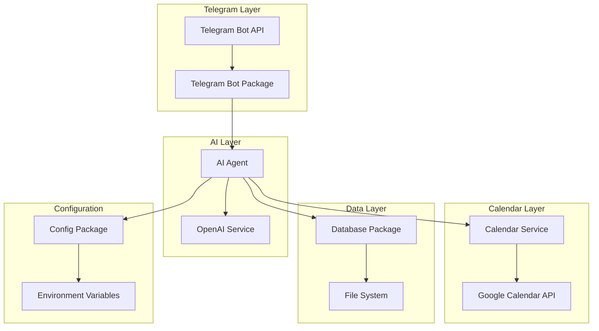

# Architecture Overview

## 🏗️ System Architecture

The Calendar Assistant Bot follows a **modular, layered architecture** designed for maintainability, testability, and extensibility.



## 🎯 Design Principles

### 1. **Separation of Concerns**
Each package has a single, well-defined responsibility:
- **`pkg/telegram`**: Telegram Bot API interactions
- **`pkg/ai`**: AI processing and decision making
- **`pkg/calendar`**: Google Calendar operations
- **`pkg/database`**: Data persistence and retrieval
- **`pkg/config`**: Configuration management
- **`pkg/types`**: Shared data structures

### 2. **Dependency Injection**
Services are injected into the AI Agent, enabling:
- Easy testing with mocks
- Flexible service swapping
- Clear dependency relationships

### 3. **Interface-Based Design**
Key interfaces allow for:
- Mock implementations in tests
- Service abstraction
- Easy extension points

## 🔄 Data Flow

### Message Processing Flow
```
1. User sends Telegram message
2. Telegram Bot receives update
3. AI Agent processes message with context
4. OpenAI generates response/action
5. AI Agent executes calendar actions if needed
6. Response sent back to user
7. Interaction stored in database
```

### Calendar Operation Flow
```
1. AI determines calendar action needed
2. Calendar Service validates parameters
3. Google Calendar API call made
4. Response parsed and formatted
5. Result returned to AI Agent
6. Formatted response sent to user
```

## 📦 Package Structure

```
pkg/
├── ai/           # AI processing and orchestration
├── calendar/     # Google Calendar integration
├── config/       # Configuration management
├── database/     # Data persistence
├── telegram/     # Telegram Bot API
└── types/        # Shared data structures

cmd/
└── bot/          # Main application entry point
```

## 🔌 Key Interfaces

### AI Agent Interface
```go
type AgentInterface interface {
    ProcessUserMessage(userID, chatID int64, message string) error
}
```

### Calendar Service Interface
```go
type CalendarServiceInterface interface {
    GetEvents(dateStr string) ([]types.CalendarEvent, error)
    CreateEvent(event types.CalendarEvent) error
    UpdateEvent(eventID string, event types.CalendarEvent) error
    DeleteEvent(eventID string) error
}
```

### Database Interface
```go
type DatabaseInterface interface {
    AddInteraction(userID int64, userMsg, aiResp, action string) error
    GetUserContext(userID int64, messageCount int) string
    GetUserInteractions(userID int64, limit int) []types.Interaction
}
```

## 🚀 Scalability Considerations

### Current Architecture Benefits
- **Horizontal scaling**: Each component can be scaled independently
- **Stateless design**: AI Agent and services are stateless
- **Async processing**: Telegram updates processed concurrently

### Future Scaling Options
- **Microservices**: Split into separate services
- **Message queues**: Add Redis/RabbitMQ for message handling
- **Load balancing**: Multiple bot instances behind load balancer
- **Database scaling**: Move from file-based to PostgreSQL/Redis

## 🔒 Security Architecture

### Authentication & Authorization
- **Telegram**: Bot token-based authentication
- **OpenAI**: API key-based authentication
- **Google Calendar**: OAuth2 service account credentials

### Data Protection
- **Environment variables**: Sensitive data stored in `.env`
- **File permissions**: Credentials directory restricted access
- **Input validation**: All user inputs validated before processing

## 📊 Monitoring & Observability

### Logging Strategy
- **Structured logging**: Consistent log format across packages
- **Log levels**: Debug, Info, Error levels for different environments
- **Context tracking**: User ID and chat ID in all log entries

### Error Handling
- **Graceful degradation**: Errors don't crash the bot
- **User feedback**: Clear error messages to users
- **Error logging**: Detailed error information for debugging

---

*Next: [API Reference](api-reference.md) - Complete function and type documentation*

